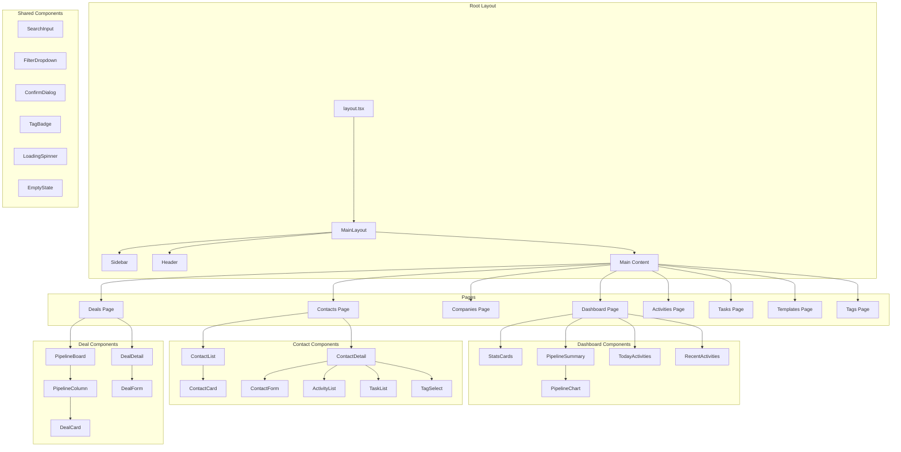
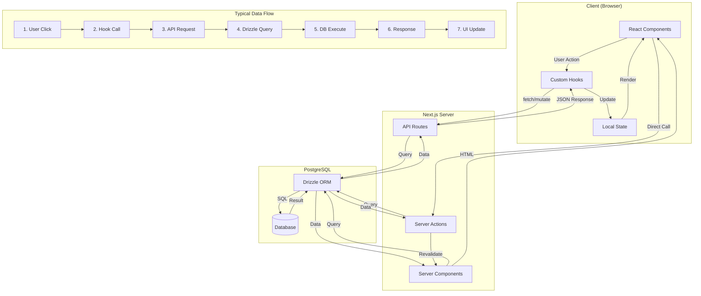
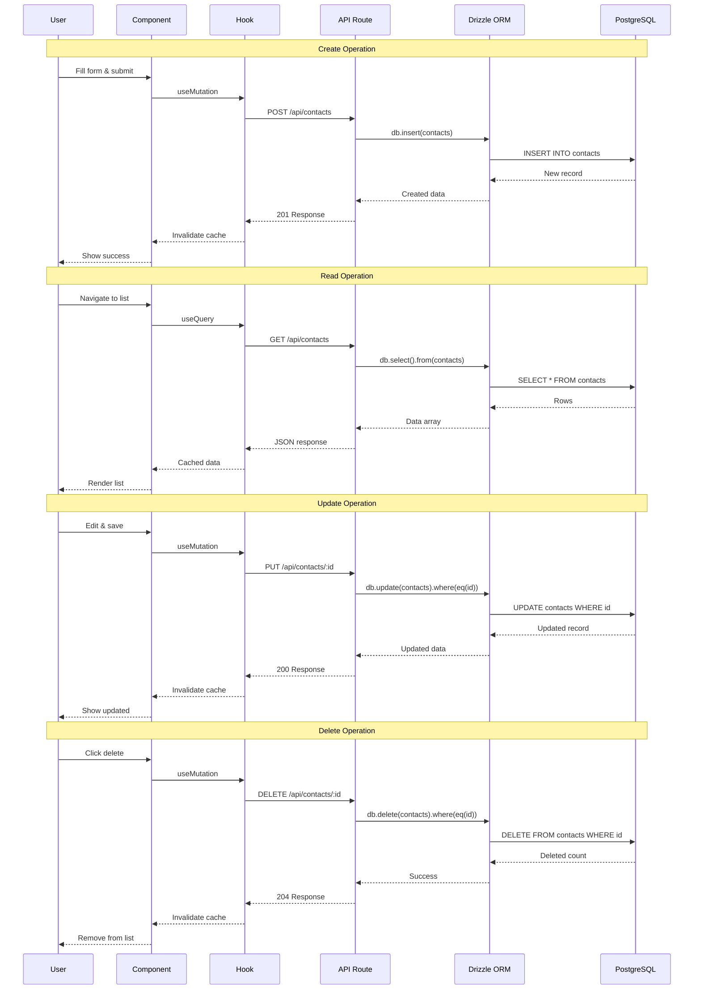
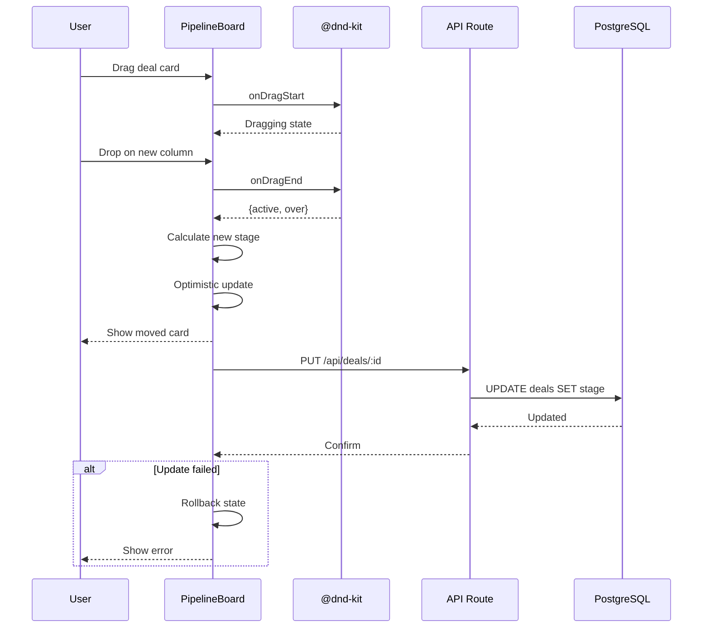

# Small Business CRM - Architecture Document

## 1. System Overview

소규모 비즈니스용 CRM 시스템으로, 고객/회사 관리, 영업 파이프라인, 활동 추적 기능을 제공합니다.

### 1.1 Tech Stack
| Layer | Technology |
|-------|------------|
| Framework | Next.js 14 (App Router) |
| Language | TypeScript |
| Database | PostgreSQL |
| ORM | Drizzle ORM |
| UI Components | shadcn/ui |
| Styling | Tailwind CSS |
| Charts | Recharts |
| Drag & Drop | @dnd-kit |
| Container | Docker (PostgreSQL) |

### 1.2 Architecture Pattern
- **Frontend**: React Server Components (RSC) + Client Components
- **Backend**: Next.js API Routes (Route Handlers)
- **Database**: PostgreSQL with Drizzle ORM
- **State Management**: React hooks + Server Actions

---

## 2. Folder Structure

```
day11-mini-crm/
├── app/                          # Next.js App Router
│   ├── layout.tsx                # Root layout
│   ├── page.tsx                  # Dashboard (home)
│   ├── (dashboard)/              # Dashboard group
│   │   └── page.tsx
│   ├── contacts/                 # Contact pages
│   │   ├── page.tsx              # List
│   │   ├── [id]/
│   │   │   └── page.tsx          # Detail
│   │   └── new/
│   │       └── page.tsx          # Create
│   ├── companies/                # Company pages
│   │   ├── page.tsx
│   │   ├── [id]/
│   │   │   └── page.tsx
│   │   └── new/
│   │       └── page.tsx
│   ├── deals/                    # Deal pages
│   │   ├── page.tsx              # Pipeline view
│   │   ├── [id]/
│   │   │   └── page.tsx
│   │   └── new/
│   │       └── page.tsx
│   ├── activities/               # Activity pages
│   │   └── page.tsx
│   ├── tasks/                    # Task pages
│   │   └── page.tsx
│   ├── templates/                # Email template pages
│   │   └── page.tsx
│   ├── tags/                     # Tag management
│   │   └── page.tsx
│   └── api/                      # API Routes
│       ├── contacts/
│       │   ├── route.ts          # GET (list), POST (create)
│       │   └── [id]/
│       │       └── route.ts      # GET, PUT, DELETE
│       ├── companies/
│       │   ├── route.ts
│       │   └── [id]/
│       │       └── route.ts
│       ├── deals/
│       │   ├── route.ts
│       │   └── [id]/
│       │       └── route.ts
│       ├── activities/
│       │   ├── route.ts
│       │   └── [id]/
│       │       └── route.ts
│       ├── tasks/
│       │   ├── route.ts
│       │   └── [id]/
│       │       └── route.ts
│       ├── tags/
│       │   ├── route.ts
│       │   └── [id]/
│       │       └── route.ts
│       ├── templates/
│       │   ├── route.ts
│       │   └── [id]/
│       │       └── route.ts
│       ├── search/
│       │   └── route.ts          # Global search
│       └── stats/
│           └── route.ts          # Dashboard stats
├── components/                   # React Components
│   ├── ui/                       # shadcn/ui components
│   │   ├── button.tsx
│   │   ├── card.tsx
│   │   ├── dialog.tsx
│   │   ├── input.tsx
│   │   ├── select.tsx
│   │   ├── table.tsx
│   │   ├── tabs.tsx
│   │   ├── badge.tsx
│   │   └── ...
│   ├── layout/                   # Layout components
│   │   ├── sidebar.tsx
│   │   ├── header.tsx
│   │   └── main-layout.tsx
│   ├── contacts/                 # Contact components
│   │   ├── contact-list.tsx
│   │   ├── contact-form.tsx
│   │   ├── contact-card.tsx
│   │   └── contact-detail.tsx
│   ├── companies/                # Company components
│   │   ├── company-list.tsx
│   │   ├── company-form.tsx
│   │   └── company-detail.tsx
│   ├── deals/                    # Deal components
│   │   ├── pipeline-board.tsx
│   │   ├── pipeline-column.tsx
│   │   ├── deal-card.tsx
│   │   ├── deal-form.tsx
│   │   └── deal-detail.tsx
│   ├── activities/               # Activity components
│   │   ├── activity-list.tsx
│   │   ├── activity-form.tsx
│   │   └── activity-item.tsx
│   ├── tasks/                    # Task components
│   │   ├── task-list.tsx
│   │   ├── task-form.tsx
│   │   └── task-item.tsx
│   ├── tags/                     # Tag components
│   │   ├── tag-list.tsx
│   │   ├── tag-form.tsx
│   │   ├── tag-badge.tsx
│   │   └── tag-select.tsx
│   ├── templates/                # Email template components
│   │   ├── template-list.tsx
│   │   ├── template-form.tsx
│   │   └── template-preview.tsx
│   ├── dashboard/                # Dashboard components
│   │   ├── stats-cards.tsx
│   │   ├── pipeline-summary.tsx
│   │   ├── today-activities.tsx
│   │   ├── recent-activities.tsx
│   │   └── charts/
│   │       ├── pipeline-chart.tsx
│   │       └── monthly-chart.tsx
│   └── shared/                   # Shared components
│       ├── search-input.tsx
│       ├── filter-dropdown.tsx
│       ├── confirm-dialog.tsx
│       ├── loading-spinner.tsx
│       └── empty-state.tsx
├── lib/                          # Utilities
│   ├── db/
│   │   ├── index.ts              # Database connection
│   │   ├── schema.ts             # Drizzle schema
│   │   └── migrations/           # Database migrations
│   ├── utils.ts                  # Helper functions
│   ├── constants.ts              # App constants
│   └── validations.ts            # Zod schemas
├── hooks/                        # Custom React hooks
│   ├── use-contacts.ts
│   ├── use-companies.ts
│   ├── use-deals.ts
│   ├── use-activities.ts
│   ├── use-tasks.ts
│   ├── use-tags.ts
│   └── use-search.ts
├── types/                        # TypeScript types
│   └── index.ts
├── public/                       # Static assets
├── docs/                         # Documentation
│   ├── PRD.md
│   └── ARCHITECTURE.md
├── drizzle.config.ts             # Drizzle configuration
├── tailwind.config.ts            # Tailwind configuration
├── next.config.js                # Next.js configuration
├── package.json
└── tsconfig.json
```

---

## 3. Component Hierarchy



---

## 4. Data Flow



### 4.1 CRUD Operations Flow



### 4.2 Pipeline Drag & Drop Flow



---

## 5. Entity Relationships

```mermaid
erDiagram
    COMPANY ||--o{ CONTACT : "has"
    COMPANY ||--o{ DEAL : "has"
    COMPANY ||--o{ ACTIVITY : "has"
    COMPANY ||--o{ TASK : "has"
    COMPANY }o--o{ TAG : "tagged with"

    CONTACT ||--o{ DEAL : "owns"
    CONTACT ||--o{ ACTIVITY : "has"
    CONTACT ||--o{ TASK : "has"
    CONTACT }o--o{ TAG : "tagged with"

    DEAL ||--o{ ACTIVITY : "has"
    DEAL ||--o{ TASK : "has"
    DEAL }o--o{ TAG : "tagged with"

    COMPANY {
        uuid id PK
        varchar name
        varchar industry
        varchar website
        text address
        int employee_count
        text memo
        timestamp created_at
        timestamp updated_at
    }

    CONTACT {
        uuid id PK
        varchar name
        varchar email
        varchar phone
        varchar position
        uuid company_id FK
        text memo
        timestamp created_at
        timestamp updated_at
    }

    DEAL {
        uuid id PK
        varchar title
        int amount
        enum stage
        date expected_close_date
        uuid contact_id FK
        uuid company_id FK
        text memo
        timestamp created_at
        timestamp updated_at
    }

    ACTIVITY {
        uuid id PK
        enum type
        varchar title
        text description
        timestamp scheduled_at
        timestamp completed_at
        uuid contact_id FK
        uuid company_id FK
        uuid deal_id FK
        timestamp created_at
    }

    TASK {
        uuid id PK
        varchar title
        text description
        date due_date
        enum priority
        boolean is_completed
        uuid contact_id FK
        uuid company_id FK
        uuid deal_id FK
        timestamp created_at
    }

    TAG {
        uuid id PK
        varchar name UK
        varchar color
    }

    CONTACT_TAG {
        uuid contact_id PK,FK
        uuid tag_id PK,FK
    }

    COMPANY_TAG {
        uuid company_id PK,FK
        uuid tag_id PK,FK
    }

    DEAL_TAG {
        uuid deal_id PK,FK
        uuid tag_id PK,FK
    }

    EMAIL_TEMPLATE {
        uuid id PK
        varchar name
        varchar subject
        text body
        timestamp created_at
        timestamp updated_at
    }
```



### 5.1 Relationship Summary

| Entity | Related To | Cardinality | ON DELETE |
|--------|-----------|-------------|-----------|
| Contact | Company | N:1 | SET NULL |
| Deal | Contact | N:1 | SET NULL |
| Deal | Company | N:1 | SET NULL |
| Activity | Contact | N:1 | CASCADE |
| Activity | Company | N:1 | CASCADE |
| Activity | Deal | N:1 | CASCADE |
| Task | Contact | N:1 | CASCADE |
| Task | Company | N:1 | CASCADE |
| Task | Deal | N:1 | CASCADE |
| Tag | Contact | M:N | CASCADE |
| Tag | Company | M:N | CASCADE |
| Tag | Deal | M:N | CASCADE |

---

## 6. Key Design Decisions

### 6.1 Architecture Decisions

| Decision | Choice | Rationale |
|----------|--------|-----------|
| **Framework** | Next.js 14 App Router | Server Components로 성능 최적화, API Routes 내장 |
| **ORM** | Drizzle | TypeScript 친화적, 경량, 직관적 쿼리 문법 |
| **UI Library** | shadcn/ui | 커스터마이징 용이, Tailwind 기반, 접근성 준수 |
| **State Management** | React hooks + Server Actions | 별도 상태관리 라이브러리 없이 간결하게 구현 |
| **Drag & Drop** | @dnd-kit | 접근성 지원, 유연한 커스터마이징, React 친화적 |

### 6.2 Database Design

| Decision | Choice | Rationale |
|----------|--------|-----------|
| **ID Type** | UUID | 분산 시스템 확장성, 보안 (추측 불가) |
| **Soft Delete** | 미사용 | 단순성 유지, CASCADE로 관련 데이터 정리 |
| **Enum** | PostgreSQL Enum | 타입 안전성, 쿼리 성능 |
| **Timestamps** | created_at, updated_at | 데이터 추적, 정렬 용이 |

### 6.3 Pipeline Design

```
Pipeline Stages (Fixed):
┌─────────┬─────────────┬──────────┬─────────────┬────────────┬─────────────┐
│  Lead   │  Qualified  │ Proposal │ Negotiation │ Closed Won │ Closed Lost │
└─────────┴─────────────┴──────────┴─────────────┴────────────┴─────────────┘
     ↔           ↔            ↔            ↔            ↔            ↔
         모든 단계 간 양방향 이동 가능
         (Closed 상태에서 이동 시 확인 필요)
```

### 6.4 API Design

| Endpoint | Method | Description |
|----------|--------|-------------|
| `/api/contacts` | GET | 연락처 목록 (필터/정렬) |
| `/api/contacts` | POST | 연락처 생성 |
| `/api/contacts/:id` | GET | 연락처 상세 |
| `/api/contacts/:id` | PUT | 연락처 수정 |
| `/api/contacts/:id` | DELETE | 연락처 삭제 |
| `/api/companies` | GET/POST | 회사 목록/생성 |
| `/api/companies/:id` | GET/PUT/DELETE | 회사 CRUD |
| `/api/deals` | GET/POST | 거래 목록/생성 |
| `/api/deals/:id` | GET/PUT/DELETE | 거래 CRUD |
| `/api/activities` | GET/POST | 활동 목록/생성 |
| `/api/tasks` | GET/POST | 태스크 목록/생성 |
| `/api/tags` | GET/POST | 태그 목록/생성 |
| `/api/templates` | GET/POST | 템플릿 목록/생성 |
| `/api/search` | GET | 전역 검색 |
| `/api/stats` | GET | 대시보드 통계 |

### 6.5 Performance Considerations

| Area | Strategy |
|------|----------|
| **Database** | 인덱스: company_id, contact_id, deal_id, stage, created_at |
| **Caching** | React Query 캐싱, Next.js ISR |
| **Pagination** | 목록 API 커서 기반 페이지네이션 |
| **DnD** | Optimistic update로 즉각적 UI 반응 |
| **Search** | Debounce (300ms), 인덱스 기반 검색 |

### 6.6 Security Considerations

| Area | Measure |
|------|---------|
| **Input Validation** | Zod 스키마로 서버/클라이언트 검증 |
| **SQL Injection** | Drizzle ORM 파라미터 바인딩 |
| **XSS** | React 기본 이스케이핑, DOMPurify (필요시) |
| **CSRF** | Next.js 기본 보호 |

---

## 7. Future Considerations

### 7.1 Scalability
- 인증/권한 시스템 (NextAuth.js)
- 멀티테넌시 지원
- 실시간 업데이트 (WebSocket)

### 7.2 Features
- 이메일 발송 통합
- 파일 첨부
- Import/Export (CSV)
- 보고서 PDF 생성

### 7.3 Infrastructure
- Redis 캐싱
- 검색 엔진 (Elasticsearch)
- CDN 이미지 최적화
