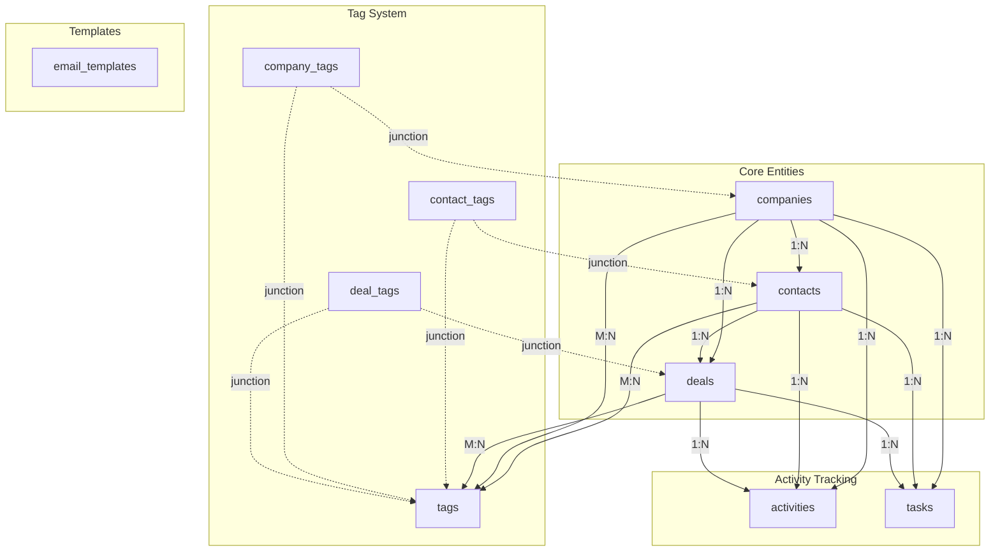
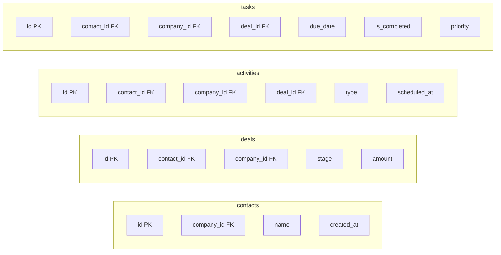
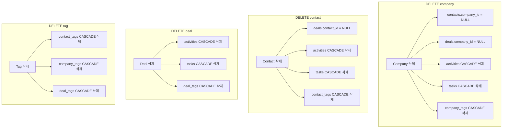

# Small Business CRM - Database Design

## 1. Schema Overview

PostgreSQL 데이터베이스와 Drizzle ORM을 사용한 CRM 데이터 모델입니다.

### 1.1 Tables Summary

| # | Table | Description | Type |
|---|-------|-------------|------|
| 1 | `companies` | 회사 정보 | Entity |
| 2 | `contacts` | 연락처 정보 | Entity |
| 3 | `deals` | 거래/영업 기회 | Entity |
| 4 | `activities` | 활동 기록 (통화, 이메일, 미팅, 노트) | Entity |
| 5 | `tasks` | 태스크/할 일 | Entity |
| 6 | `tags` | 태그 마스터 | Entity |
| 7 | `email_templates` | 이메일 템플릿 | Entity |
| 8 | `contact_tags` | 연락처-태그 연결 | Junction |
| 9 | `company_tags` | 회사-태그 연결 | Junction |
| 10 | `deal_tags` | 거래-태그 연결 | Junction |

### 1.2 Enums

```sql
-- 거래 단계
CREATE TYPE deal_stage AS ENUM (
  'lead',
  'qualified',
  'proposal',
  'negotiation',
  'closed_won',
  'closed_lost'
);

-- 활동 유형
CREATE TYPE activity_type AS ENUM (
  'call',
  'email',
  'meeting',
  'note'
);

-- 우선순위
CREATE TYPE priority AS ENUM (
  'low',
  'medium',
  'high'
);
```

---

## 2. Entity Relationship Diagram

```mermaid
erDiagram
    companies ||--o{ contacts : "employs"
    companies ||--o{ deals : "involved in"
    companies ||--o{ activities : "has"
    companies ||--o{ tasks : "has"
    companies }o--o{ tags : "tagged"

    contacts ||--o{ deals : "owns"
    contacts ||--o{ activities : "has"
    contacts ||--o{ tasks : "has"
    contacts }o--o{ tags : "tagged"

    deals ||--o{ activities : "has"
    deals ||--o{ tasks : "has"
    deals }o--o{ tags : "tagged"

    companies {
        uuid id PK "DEFAULT gen_random_uuid()"
        varchar_200 name "NOT NULL"
        varchar_100 industry "NULL"
        varchar_255 website "NULL"
        text address "NULL"
        integer employee_count "NULL"
        text memo "NULL"
        timestamp created_at "DEFAULT NOW()"
        timestamp updated_at "DEFAULT NOW()"
    }

    contacts {
        uuid id PK "DEFAULT gen_random_uuid()"
        varchar_100 name "NOT NULL"
        varchar_255 email "NULL"
        varchar_20 phone "NULL"
        varchar_100 position "NULL"
        uuid company_id FK "NULL → companies.id"
        text memo "NULL"
        timestamp created_at "DEFAULT NOW()"
        timestamp updated_at "DEFAULT NOW()"
    }

    deals {
        uuid id PK "DEFAULT gen_random_uuid()"
        varchar_200 title "NOT NULL"
        bigint amount "NOT NULL DEFAULT 0"
        deal_stage stage "NOT NULL DEFAULT 'lead'"
        date expected_close_date "NULL"
        uuid contact_id FK "NULL → contacts.id"
        uuid company_id FK "NULL → companies.id"
        text memo "NULL"
        timestamp created_at "DEFAULT NOW()"
        timestamp updated_at "DEFAULT NOW()"
    }

    activities {
        uuid id PK "DEFAULT gen_random_uuid()"
        activity_type type "NOT NULL"
        varchar_200 title "NOT NULL"
        text description "NULL"
        timestamp scheduled_at "NULL"
        timestamp completed_at "NULL"
        uuid contact_id FK "NULL → contacts.id CHECK"
        uuid company_id FK "NULL → companies.id CHECK"
        uuid deal_id FK "NULL → deals.id CHECK"
        timestamp created_at "DEFAULT NOW()"
        timestamp updated_at "DEFAULT NOW()"
    }

    tasks {
        uuid id PK "DEFAULT gen_random_uuid()"
        varchar_200 title "NOT NULL"
        text description "NULL"
        date due_date "NULL"
        priority priority "NOT NULL DEFAULT 'medium'"
        boolean is_completed "DEFAULT FALSE"
        uuid contact_id FK "NULL → contacts.id"
        uuid company_id FK "NULL → companies.id"
        uuid deal_id FK "NULL → deals.id"
        timestamp created_at "DEFAULT NOW()"
        timestamp updated_at "DEFAULT NOW()"
    }

    tags {
        uuid id PK "DEFAULT gen_random_uuid()"
        varchar_50 name "NOT NULL UNIQUE"
        varchar_7 color "NOT NULL DEFAULT '#3B82F6'"
    }

    contact_tags {
        uuid contact_id PK_FK "→ contacts.id"
        uuid tag_id PK_FK "→ tags.id"
    }

    company_tags {
        uuid company_id PK_FK "→ companies.id"
        uuid tag_id PK_FK "→ tags.id"
    }

    deal_tags {
        uuid deal_id PK_FK "→ deals.id"
        uuid tag_id PK_FK "→ tags.id"
    }

    email_templates {
        uuid id PK "DEFAULT gen_random_uuid()"
        varchar_100 name "NOT NULL"
        varchar_255 subject "NOT NULL"
        text body "NOT NULL"
        timestamp created_at "DEFAULT NOW()"
        timestamp updated_at "DEFAULT NOW()"
    }
```

---

## 3. Table Definitions

### 3.1 companies

```sql
CREATE TABLE companies (
  id UUID PRIMARY KEY DEFAULT gen_random_uuid(),
  name VARCHAR(200) NOT NULL,
  industry VARCHAR(100),
  website VARCHAR(255),
  address TEXT,
  employee_count INTEGER,
  memo TEXT,
  created_at TIMESTAMP DEFAULT NOW(),
  updated_at TIMESTAMP DEFAULT NOW()
);
```

**Drizzle Schema:**
```typescript
export const companies = pgTable('companies', {
  id: uuid('id').primaryKey().defaultRandom(),
  name: varchar('name', { length: 200 }).notNull(),
  industry: varchar('industry', { length: 100 }),
  website: varchar('website', { length: 255 }),
  address: text('address'),
  employeeCount: integer('employee_count'),
  memo: text('memo'),
  createdAt: timestamp('created_at').defaultNow(),
  updatedAt: timestamp('updated_at').defaultNow(),
});
```

### 3.2 contacts

```sql
CREATE TABLE contacts (
  id UUID PRIMARY KEY DEFAULT gen_random_uuid(),
  name VARCHAR(100) NOT NULL,
  email VARCHAR(255),
  phone VARCHAR(20),
  position VARCHAR(100),
  company_id UUID REFERENCES companies(id) ON DELETE SET NULL,
  memo TEXT,
  created_at TIMESTAMP DEFAULT NOW(),
  updated_at TIMESTAMP DEFAULT NOW()
);
```

**Drizzle Schema:**
```typescript
export const contacts = pgTable('contacts', {
  id: uuid('id').primaryKey().defaultRandom(),
  name: varchar('name', { length: 100 }).notNull(),
  email: varchar('email', { length: 255 }),
  phone: varchar('phone', { length: 20 }),
  position: varchar('position', { length: 100 }),
  companyId: uuid('company_id').references(() => companies.id, { onDelete: 'set null' }),
  memo: text('memo'),
  createdAt: timestamp('created_at').defaultNow(),
  updatedAt: timestamp('updated_at').defaultNow(),
});
```

### 3.3 deals

```sql
CREATE TABLE deals (
  id UUID PRIMARY KEY DEFAULT gen_random_uuid(),
  title VARCHAR(200) NOT NULL,
  amount BIGINT NOT NULL DEFAULT 0,  -- BIGINT for large deal amounts
  stage deal_stage NOT NULL DEFAULT 'lead',
  expected_close_date DATE,
  contact_id UUID REFERENCES contacts(id) ON DELETE SET NULL,
  company_id UUID REFERENCES companies(id) ON DELETE SET NULL,
  memo TEXT,
  created_at TIMESTAMP DEFAULT NOW(),
  updated_at TIMESTAMP DEFAULT NOW()
);
```

**Drizzle Schema:**
```typescript
export const dealStageEnum = pgEnum('deal_stage', [
  'lead', 'qualified', 'proposal', 'negotiation', 'closed_won', 'closed_lost'
]);

export const deals = pgTable('deals', {
  id: uuid('id').primaryKey().defaultRandom(),
  title: varchar('title', { length: 200 }).notNull(),
  amount: bigint('amount', { mode: 'number' }).notNull().default(0), // BIGINT for large amounts
  stage: dealStageEnum('stage').notNull().default('lead'),
  expectedCloseDate: date('expected_close_date'),
  contactId: uuid('contact_id').references(() => contacts.id, { onDelete: 'set null' }),
  companyId: uuid('company_id').references(() => companies.id, { onDelete: 'set null' }),
  memo: text('memo'),
  createdAt: timestamp('created_at').defaultNow(),
  updatedAt: timestamp('updated_at').defaultNow(),
});
```

### 3.4 activities

```sql
CREATE TABLE activities (
  id UUID PRIMARY KEY DEFAULT gen_random_uuid(),
  type activity_type NOT NULL,
  title VARCHAR(200) NOT NULL,
  description TEXT,
  scheduled_at TIMESTAMP,
  completed_at TIMESTAMP,
  contact_id UUID REFERENCES contacts(id) ON DELETE CASCADE,
  company_id UUID REFERENCES companies(id) ON DELETE CASCADE,
  deal_id UUID REFERENCES deals(id) ON DELETE CASCADE,
  created_at TIMESTAMP DEFAULT NOW(),
  updated_at TIMESTAMP DEFAULT NOW(),
  -- At least one parent must be linked
  CONSTRAINT chk_activity_has_parent CHECK (
    contact_id IS NOT NULL OR company_id IS NOT NULL OR deal_id IS NOT NULL
  )
);
```

**Drizzle Schema:**
```typescript
export const activityTypeEnum = pgEnum('activity_type', ['call', 'email', 'meeting', 'note']);

export const activities = pgTable('activities', {
  id: uuid('id').primaryKey().defaultRandom(),
  type: activityTypeEnum('type').notNull(),
  title: varchar('title', { length: 200 }).notNull(),
  description: text('description'),
  scheduledAt: timestamp('scheduled_at'),
  completedAt: timestamp('completed_at'),
  contactId: uuid('contact_id').references(() => contacts.id, { onDelete: 'cascade' }),
  companyId: uuid('company_id').references(() => companies.id, { onDelete: 'cascade' }),
  dealId: uuid('deal_id').references(() => deals.id, { onDelete: 'cascade' }),
  createdAt: timestamp('created_at').defaultNow(),
  updatedAt: timestamp('updated_at').defaultNow(),
});
// Note: Add CHECK constraint via migration for at least one parent FK
```

### 3.5 tasks

```sql
CREATE TABLE tasks (
  id UUID PRIMARY KEY DEFAULT gen_random_uuid(),
  title VARCHAR(200) NOT NULL,
  description TEXT,
  due_date DATE,
  priority priority NOT NULL DEFAULT 'medium',
  is_completed BOOLEAN DEFAULT FALSE,
  contact_id UUID REFERENCES contacts(id) ON DELETE CASCADE,
  company_id UUID REFERENCES companies(id) ON DELETE CASCADE,
  deal_id UUID REFERENCES deals(id) ON DELETE CASCADE,
  created_at TIMESTAMP DEFAULT NOW(),
  updated_at TIMESTAMP DEFAULT NOW()
);
```

**Drizzle Schema:**
```typescript
export const priorityEnum = pgEnum('priority', ['low', 'medium', 'high']);

export const tasks = pgTable('tasks', {
  id: uuid('id').primaryKey().defaultRandom(),
  title: varchar('title', { length: 200 }).notNull(),
  description: text('description'),
  dueDate: date('due_date'),
  priority: priorityEnum('priority').notNull().default('medium'),
  isCompleted: boolean('is_completed').default(false),
  contactId: uuid('contact_id').references(() => contacts.id, { onDelete: 'cascade' }),
  companyId: uuid('company_id').references(() => companies.id, { onDelete: 'cascade' }),
  dealId: uuid('deal_id').references(() => deals.id, { onDelete: 'cascade' }),
  createdAt: timestamp('created_at').defaultNow(),
  updatedAt: timestamp('updated_at').defaultNow(),
});
```

### 3.6 tags

```sql
CREATE TABLE tags (
  id UUID PRIMARY KEY DEFAULT gen_random_uuid(),
  name VARCHAR(50) NOT NULL UNIQUE,
  color VARCHAR(7) NOT NULL DEFAULT '#3B82F6'
);
```

**Drizzle Schema:**
```typescript
export const tags = pgTable('tags', {
  id: uuid('id').primaryKey().defaultRandom(),
  name: varchar('name', { length: 50 }).notNull().unique(),
  color: varchar('color', { length: 7 }).notNull().default('#3B82F6'),
});
```

### 3.7 Junction Tables (Tags)

```sql
-- contact_tags
CREATE TABLE contact_tags (
  contact_id UUID NOT NULL REFERENCES contacts(id) ON DELETE CASCADE,
  tag_id UUID NOT NULL REFERENCES tags(id) ON DELETE CASCADE,
  PRIMARY KEY (contact_id, tag_id)
);

-- company_tags
CREATE TABLE company_tags (
  company_id UUID NOT NULL REFERENCES companies(id) ON DELETE CASCADE,
  tag_id UUID NOT NULL REFERENCES tags(id) ON DELETE CASCADE,
  PRIMARY KEY (company_id, tag_id)
);

-- deal_tags
CREATE TABLE deal_tags (
  deal_id UUID NOT NULL REFERENCES deals(id) ON DELETE CASCADE,
  tag_id UUID NOT NULL REFERENCES tags(id) ON DELETE CASCADE,
  PRIMARY KEY (deal_id, tag_id)
);
```

**Drizzle Schema:**
```typescript
export const contactTags = pgTable('contact_tags', {
  contactId: uuid('contact_id').references(() => contacts.id, { onDelete: 'cascade' }).notNull(),
  tagId: uuid('tag_id').references(() => tags.id, { onDelete: 'cascade' }).notNull(),
}, (t) => ({
  pk: primaryKey({ columns: [t.contactId, t.tagId] }),
}));

export const companyTags = pgTable('company_tags', {
  companyId: uuid('company_id').references(() => companies.id, { onDelete: 'cascade' }).notNull(),
  tagId: uuid('tag_id').references(() => tags.id, { onDelete: 'cascade' }).notNull(),
}, (t) => ({
  pk: primaryKey({ columns: [t.companyId, t.tagId] }),
}));

export const dealTags = pgTable('deal_tags', {
  dealId: uuid('deal_id').references(() => deals.id, { onDelete: 'cascade' }).notNull(),
  tagId: uuid('tag_id').references(() => tags.id, { onDelete: 'cascade' }).notNull(),
}, (t) => ({
  pk: primaryKey({ columns: [t.dealId, t.tagId] }),
}));
```

### 3.8 email_templates

```sql
CREATE TABLE email_templates (
  id UUID PRIMARY KEY DEFAULT gen_random_uuid(),
  name VARCHAR(100) NOT NULL,
  subject VARCHAR(255) NOT NULL,
  body TEXT NOT NULL,
  created_at TIMESTAMP DEFAULT NOW(),
  updated_at TIMESTAMP DEFAULT NOW()
);
```

**Drizzle Schema:**
```typescript
export const emailTemplates = pgTable('email_templates', {
  id: uuid('id').primaryKey().defaultRandom(),
  name: varchar('name', { length: 100 }).notNull(),
  subject: varchar('subject', { length: 255 }).notNull(),
  body: text('body').notNull(),
  createdAt: timestamp('created_at').defaultNow(),
  updatedAt: timestamp('updated_at').defaultNow(),
});
```

---

## 4. Table Relationships

### 4.1 Relationship Diagram



### 4.2 Relationship Matrix

| Parent | Child | Cardinality | FK Column | ON DELETE |
|--------|-------|-------------|-----------|-----------|
| companies | contacts | 1:N | company_id | SET NULL |
| companies | deals | 1:N | company_id | SET NULL |
| companies | activities | 1:N | company_id | CASCADE |
| companies | tasks | 1:N | company_id | CASCADE |
| contacts | deals | 1:N | contact_id | SET NULL |
| contacts | activities | 1:N | contact_id | CASCADE |
| contacts | tasks | 1:N | contact_id | CASCADE |
| deals | activities | 1:N | deal_id | CASCADE |
| deals | tasks | 1:N | deal_id | CASCADE |
| contacts | tags | M:N | (junction) | CASCADE |
| companies | tags | M:N | (junction) | CASCADE |
| deals | tags | M:N | (junction) | CASCADE |

---

## 5. Indexes

### 5.1 Primary Indexes (Auto-created)

| Table | Column | Type |
|-------|--------|------|
| companies | id | PRIMARY KEY |
| contacts | id | PRIMARY KEY |
| deals | id | PRIMARY KEY |
| activities | id | PRIMARY KEY |
| tasks | id | PRIMARY KEY |
| tags | id | PRIMARY KEY |
| email_templates | id | PRIMARY KEY |
| contact_tags | (contact_id, tag_id) | COMPOSITE PK |
| company_tags | (company_id, tag_id) | COMPOSITE PK |
| deal_tags | (deal_id, tag_id) | COMPOSITE PK |

### 5.2 Unique Indexes

```sql
-- Case-insensitive unique tag names
CREATE UNIQUE INDEX idx_tags_name_lower ON tags(LOWER(name));
```

### 5.3 Foreign Key Indexes

```sql
-- contacts
CREATE INDEX idx_contacts_company_id ON contacts(company_id);

-- deals
CREATE INDEX idx_deals_contact_id ON deals(contact_id);
CREATE INDEX idx_deals_company_id ON deals(company_id);
CREATE INDEX idx_deals_stage ON deals(stage);

-- activities
CREATE INDEX idx_activities_contact_id ON activities(contact_id);
CREATE INDEX idx_activities_company_id ON activities(company_id);
CREATE INDEX idx_activities_deal_id ON activities(deal_id);
CREATE INDEX idx_activities_type ON activities(type);
CREATE INDEX idx_activities_scheduled_at ON activities(scheduled_at);

-- tasks
CREATE INDEX idx_tasks_contact_id ON tasks(contact_id);
CREATE INDEX idx_tasks_company_id ON tasks(company_id);
CREATE INDEX idx_tasks_deal_id ON tasks(deal_id);
CREATE INDEX idx_tasks_due_date ON tasks(due_date);
CREATE INDEX idx_tasks_is_completed ON tasks(is_completed);
CREATE INDEX idx_tasks_priority ON tasks(priority);

-- junction tables (reverse lookup)
CREATE INDEX idx_contact_tags_tag_id ON contact_tags(tag_id);
CREATE INDEX idx_company_tags_tag_id ON company_tags(tag_id);
CREATE INDEX idx_deal_tags_tag_id ON deal_tags(tag_id);
```

### 5.4 Query Optimization Indexes

```sql
-- 대시보드: 오늘 예정 활동
CREATE INDEX idx_activities_scheduled_today
  ON activities(scheduled_at)
  WHERE completed_at IS NULL;

-- 파이프라인: 단계별 거래
CREATE INDEX idx_deals_stage_amount ON deals(stage, amount);

-- 검색: 이름 기반
CREATE INDEX idx_contacts_name ON contacts(name);
CREATE INDEX idx_companies_name ON companies(name);
CREATE INDEX idx_deals_title ON deals(title);

-- 정렬: 생성일
CREATE INDEX idx_contacts_created_at ON contacts(created_at DESC);
CREATE INDEX idx_companies_created_at ON companies(created_at DESC);
CREATE INDEX idx_deals_created_at ON deals(created_at DESC);
CREATE INDEX idx_activities_created_at ON activities(created_at DESC);

-- updatedAt 인덱스 (동시성 제어용)
CREATE INDEX idx_deals_updated_at ON deals(updated_at);
CREATE INDEX idx_activities_updated_at ON activities(updated_at);
CREATE INDEX idx_tasks_updated_at ON tasks(updated_at);
```

### 5.5 Full-Text Search Indexes (pg_trgm)

```sql
-- PostgreSQL pg_trgm 확장 활성화
CREATE EXTENSION IF NOT EXISTS pg_trgm;

-- 검색 성능 최적화를 위한 GIN 인덱스
CREATE INDEX idx_contacts_name_trgm ON contacts USING GIN (name gin_trgm_ops);
CREATE INDEX idx_companies_name_trgm ON companies USING GIN (name gin_trgm_ops);
CREATE INDEX idx_deals_title_trgm ON deals USING GIN (title gin_trgm_ops);

-- 이메일 검색용
CREATE INDEX idx_contacts_email_trgm ON contacts USING GIN (email gin_trgm_ops);
```

### 5.5 Index Summary Diagram



---

## 6. Foreign Keys & Cascade Policies

### 6.1 Cascade Policy Overview



### 6.2 Foreign Key Constraints

| Table | Column | References | ON DELETE | Rationale |
|-------|--------|------------|-----------|-----------|
| contacts | company_id | companies.id | SET NULL | 회사 삭제해도 연락처 유지 |
| deals | contact_id | contacts.id | SET NULL | 연락처 삭제해도 거래 유지 |
| deals | company_id | companies.id | SET NULL | 회사 삭제해도 거래 유지 |
| activities | contact_id | contacts.id | CASCADE | 연락처 삭제시 활동도 삭제 |
| activities | company_id | companies.id | CASCADE | 회사 삭제시 활동도 삭제 |
| activities | deal_id | deals.id | CASCADE | 거래 삭제시 활동도 삭제 |
| tasks | contact_id | contacts.id | CASCADE | 연락처 삭제시 태스크도 삭제 |
| tasks | company_id | companies.id | CASCADE | 회사 삭제시 태스크도 삭제 |
| tasks | deal_id | deals.id | CASCADE | 거래 삭제시 태스크도 삭제 |
| contact_tags | contact_id | contacts.id | CASCADE | 연락처 삭제시 태그 연결 삭제 |
| contact_tags | tag_id | tags.id | CASCADE | 태그 삭제시 연결 삭제 |
| company_tags | company_id | companies.id | CASCADE | 회사 삭제시 태그 연결 삭제 |
| company_tags | tag_id | tags.id | CASCADE | 태그 삭제시 연결 삭제 |
| deal_tags | deal_id | deals.id | CASCADE | 거래 삭제시 태그 연결 삭제 |
| deal_tags | tag_id | tags.id | CASCADE | 태그 삭제시 연결 삭제 |

### 6.3 Cascade Delete Examples

```sql
-- 회사 삭제 시 영향
DELETE FROM companies WHERE id = 'xxx';
-- → contacts.company_id = NULL (연락처 유지)
-- → deals.company_id = NULL (거래 유지)
-- → activities WHERE company_id = 'xxx' 삭제
-- → tasks WHERE company_id = 'xxx' 삭제
-- → company_tags WHERE company_id = 'xxx' 삭제

-- 연락처 삭제 시 영향
DELETE FROM contacts WHERE id = 'yyy';
-- → deals.contact_id = NULL (거래 유지)
-- → activities WHERE contact_id = 'yyy' 삭제
-- → tasks WHERE contact_id = 'yyy' 삭제
-- → contact_tags WHERE contact_id = 'yyy' 삭제

-- 거래 삭제 시 영향
DELETE FROM deals WHERE id = 'zzz';
-- → activities WHERE deal_id = 'zzz' 삭제
-- → tasks WHERE deal_id = 'zzz' 삭제
-- → deal_tags WHERE deal_id = 'zzz' 삭제
```

---

## 7. Query Patterns

### 7.1 Contact Queries

```typescript
// 연락처 목록 (회사 정보 포함)
const contacts = await db
  .select({
    contact: contacts,
    company: companies,
  })
  .from(contacts)
  .leftJoin(companies, eq(contacts.companyId, companies.id))
  .orderBy(desc(contacts.createdAt));

// 연락처 상세 (태그 포함)
const contact = await db
  .select()
  .from(contacts)
  .where(eq(contacts.id, contactId))
  .leftJoin(contactTags, eq(contacts.id, contactTags.contactId))
  .leftJoin(tags, eq(contactTags.tagId, tags.id));

// 연락처 검색
const results = await db
  .select()
  .from(contacts)
  .where(
    or(
      ilike(contacts.name, `%${query}%`),
      ilike(contacts.email, `%${query}%`)
    )
  );
```

### 7.2 Deal Queries

```typescript
// 파이프라인 (단계별 거래)
const pipeline = await db
  .select({
    deal: deals,
    contact: contacts,
    company: companies,
  })
  .from(deals)
  .leftJoin(contacts, eq(deals.contactId, contacts.id))
  .leftJoin(companies, eq(deals.companyId, companies.id))
  .orderBy(deals.stage, desc(deals.amount));

// 단계별 금액 합계
const stageSummary = await db
  .select({
    stage: deals.stage,
    totalAmount: sql<number>`SUM(${deals.amount})`,
    count: sql<number>`COUNT(*)`,
  })
  .from(deals)
  .groupBy(deals.stage);

// 거래 단계 변경
await db
  .update(deals)
  .set({
    stage: newStage,
    updatedAt: new Date()
  })
  .where(eq(deals.id, dealId));
```

### 7.3 Activity Queries

```typescript
// 오늘 예정 활동
const todayActivities = await db
  .select()
  .from(activities)
  .where(
    and(
      gte(activities.scheduledAt, startOfDay),
      lte(activities.scheduledAt, endOfDay),
      isNull(activities.completedAt)
    )
  )
  .orderBy(activities.scheduledAt);

// 연락처별 활동 내역
const contactActivities = await db
  .select()
  .from(activities)
  .where(eq(activities.contactId, contactId))
  .orderBy(desc(activities.createdAt));

// 최근 활동 (대시보드)
const recentActivities = await db
  .select({
    activity: activities,
    contact: contacts,
    company: companies,
    deal: deals,
  })
  .from(activities)
  .leftJoin(contacts, eq(activities.contactId, contacts.id))
  .leftJoin(companies, eq(activities.companyId, companies.id))
  .leftJoin(deals, eq(activities.dealId, deals.id))
  .orderBy(desc(activities.createdAt))
  .limit(10);
```

### 7.4 Task Queries

```typescript
// 미완료 태스크 (우선순위별)
const pendingTasks = await db
  .select()
  .from(tasks)
  .where(eq(tasks.isCompleted, false))
  .orderBy(
    sql`CASE priority
      WHEN 'high' THEN 1
      WHEN 'medium' THEN 2
      WHEN 'low' THEN 3
    END`,
    tasks.dueDate
  );

// 이번 주 마감 태스크
const weekTasks = await db
  .select()
  .from(tasks)
  .where(
    and(
      gte(tasks.dueDate, startOfWeek),
      lte(tasks.dueDate, endOfWeek),
      eq(tasks.isCompleted, false)
    )
  );

// 태스크 완료 처리
await db
  .update(tasks)
  .set({ isCompleted: true })
  .where(eq(tasks.id, taskId));
```

### 7.5 Tag Queries

```typescript
// 태그별 연락처 조회
const taggedContacts = await db
  .select({ contact: contacts })
  .from(contacts)
  .innerJoin(contactTags, eq(contacts.id, contactTags.contactId))
  .where(eq(contactTags.tagId, tagId));

// 연락처에 태그 추가
await db.insert(contactTags).values({
  contactId,
  tagId,
});

// 연락처에서 태그 제거
await db
  .delete(contactTags)
  .where(
    and(
      eq(contactTags.contactId, contactId),
      eq(contactTags.tagId, tagId)
    )
  );
```

### 7.6 Dashboard Statistics

```typescript
// 대시보드 통계
const stats = await Promise.all([
  // 총 연락처 수
  db.select({ count: sql<number>`COUNT(*)` }).from(contacts),

  // 총 회사 수
  db.select({ count: sql<number>`COUNT(*)` }).from(companies),

  // 진행 중 거래 수
  db.select({ count: sql<number>`COUNT(*)` })
    .from(deals)
    .where(notInArray(deals.stage, ['closed_won', 'closed_lost'])),

  // 이번 달 성사 거래 금액
  db.select({ total: sql<number>`COALESCE(SUM(amount), 0)` })
    .from(deals)
    .where(
      and(
        eq(deals.stage, 'closed_won'),
        gte(deals.updatedAt, startOfMonth)
      )
    ),
]);
```

### 7.7 Global Search

```typescript
// 전역 검색 (연락처, 회사, 거래)
const searchResults = await Promise.all([
  db.select()
    .from(contacts)
    .where(ilike(contacts.name, `%${query}%`))
    .limit(5),

  db.select()
    .from(companies)
    .where(ilike(companies.name, `%${query}%`))
    .limit(5),

  db.select()
    .from(deals)
    .where(ilike(deals.title, `%${query}%`))
    .limit(5),
]);
```

### 7.8 Pagination Queries

```typescript
// Cursor-based pagination (권장)
const contacts = await db
  .select()
  .from(contacts)
  .where(cursor ? gt(contacts.id, cursor) : undefined)
  .orderBy(contacts.createdAt)
  .limit(20);

// Offset-based pagination
const contacts = await db
  .select()
  .from(contacts)
  .orderBy(desc(contacts.createdAt))
  .limit(pageSize)
  .offset((page - 1) * pageSize);

// Total count for pagination
const [{ count }] = await db
  .select({ count: sql<number>`COUNT(*)` })
  .from(contacts);
```

### 7.9 Delete Preview Query

```typescript
// 삭제 전 영향도 확인 API
async function getDeletePreview(companyId: string) {
  const [contacts, deals, activities, tasks, tags] = await Promise.all([
    db.select({ count: sql<number>`COUNT(*)` })
      .from(contactsTable)
      .where(eq(contactsTable.companyId, companyId)),
    db.select({ count: sql<number>`COUNT(*)` })
      .from(dealsTable)
      .where(eq(dealsTable.companyId, companyId)),
    db.select({ count: sql<number>`COUNT(*)` })
      .from(activitiesTable)
      .where(eq(activitiesTable.companyId, companyId)),
    db.select({ count: sql<number>`COUNT(*)` })
      .from(tasksTable)
      .where(eq(tasksTable.companyId, companyId)),
    db.select({ count: sql<number>`COUNT(*)` })
      .from(companyTags)
      .where(eq(companyTags.companyId, companyId)),
  ]);

  return {
    contacts: contacts[0].count,      // SET NULL 처리
    deals: deals[0].count,            // SET NULL 처리
    activities: activities[0].count,  // CASCADE 삭제
    tasks: tasks[0].count,            // CASCADE 삭제
    tags: tags[0].count,              // 연결 해제
  };
}
```

### 7.10 Optimistic Locking Query

```typescript
// 동시성 제어를 위한 낙관적 락
async function updateDealWithLock(
  dealId: string,
  newStage: DealStage,
  originalUpdatedAt: Date
) {
  const result = await db
    .update(deals)
    .set({
      stage: newStage,
      updatedAt: new Date(),
    })
    .where(
      and(
        eq(deals.id, dealId),
        eq(deals.updatedAt, originalUpdatedAt) // 낙관적 락
      )
    )
    .returning();

  if (result.length === 0) {
    throw new ConflictError('Deal was modified by another user');
  }

  return result[0];
}
```

---

## 8. Migration Strategy

### 8.1 Initial Migration

```bash
# Drizzle 마이그레이션 생성
npx drizzle-kit generate:pg

# 마이그레이션 실행
npx drizzle-kit push:pg
```

### 8.2 Migration Files Structure

```
lib/db/migrations/
├── 0000_initial_schema.sql
├── 0001_add_enums.sql
├── 0002_create_companies.sql
├── 0003_create_contacts.sql
├── 0004_create_deals.sql
├── 0005_create_activities.sql
├── 0006_create_tasks.sql
├── 0007_create_tags.sql
├── 0008_create_junction_tables.sql
├── 0009_create_email_templates.sql
└── 0010_create_indexes.sql
```

---

## 9. Seed Data

```typescript
// 초기 파이프라인 단계는 Enum으로 고정
// 샘플 태그 생성
const sampleTags = [
  { name: 'VIP', color: '#EF4444' },
  { name: '대기업', color: '#3B82F6' },
  { name: '스타트업', color: '#10B981' },
  { name: '서울', color: '#8B5CF6' },
  { name: '기술', color: '#F59E0B' },
];

await db.insert(tags).values(sampleTags);
```
